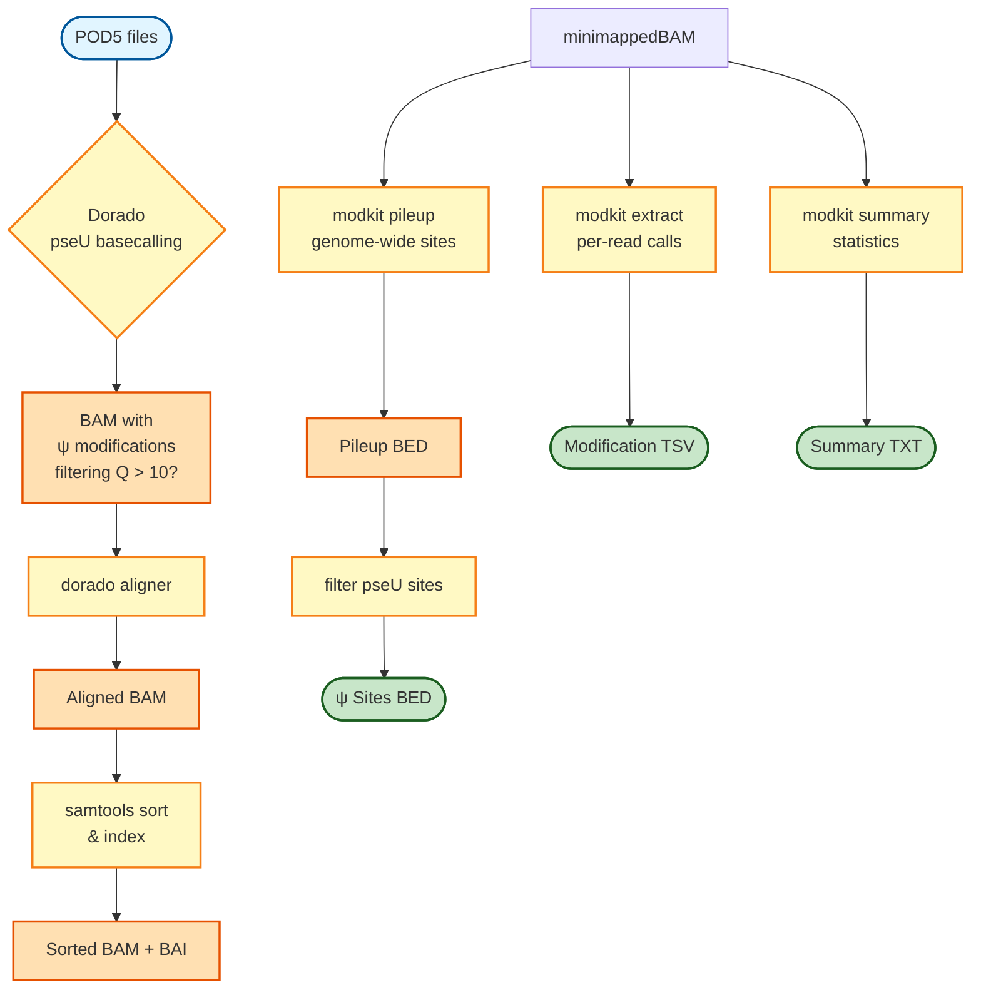

# Pseudouridine (ψ) Modification Analysis Pipeline Flowchart



## Pipeline Overview

### Input Requirements
- **POD5 Files**: Raw sequencing data from Oxford Nanopore
- **Reference Genome**: FASTA format for alignment

### Workflow Stages

#### 1. Basecalling with Modification Detection
- **basecalling_pseU**: Dorado basecaller with `--modified-bases pseU`
- Detects pseudouridine (ψ) modifications during basecalling
- Output: BAM files with modification tags

#### 2. Alignment with Quality Filtering
- **dorado_align**: Aligns basecalled BAM to reference
- Filters reads by Q score using `--min-qscore` (default: 10)
- Preserves modification information throughout alignment

#### 3. Post-processing
- **samtools_sort**: Sort BAM by coordinates
- **samtools index**: Create BAI index

#### 4. Modification Analysis (3 parallel processes)

##### a. Genome-wide Modification Sites
- **modkit_pileup**: Generates per-site modification frequencies
  - Minimum coverage: 5 (default)
  - Probability threshold: 0.8 (default)
- **filter_pseU**: Extracts only pseudouridine sites from pileup

##### b. Per-read Modification Calls
- **modkit_extract**: Extracts read-level modification information
- Output: TSV with modification calls for each read

##### c. Summary Statistics
- **modkit_summary**: Generates overall modification statistics
- Output: Summary text file

### Output Files

```
results/
├── basecalling_pseU/     # Basecalled BAM files with ψ modifications
├── alignment/            # Dorado aligned BAM files (Q score filtered)
├── bam/                  # Sorted BAM files and indices
├── modkit_pileup/        # Per-site modification frequencies (BED)
├── pseU_sites/           # Filtered pseudouridine sites (BED)
├── modkit_extract/       # Read-level modification calls (TSV)
└── modkit_summary/       # Summary statistics (TXT)
```

## Key Parameters

```bash
--min_qscore 10         # Minimum Q score for read filtering during alignment
--min_coverage 5        # Minimum coverage for modkit pileup
--prob_threshold 0.8    # Probability threshold for modification calls
--mm2opts "-ax sr"      # Minimap2 options for dorado aligner
```

## Usage Example

```bash
# Standard run
nextflow run workflows/pseU_analysis.nf \
    --sample_info sample_info.txt \
    --reference genome.fa

# Custom parameters
nextflow run workflows/pseU_analysis.nf \
    --sample_info sample_info.txt \
    --reference genome.fa \
    --min_qscore 15 \
    --min_coverage 10 \
    --prob_threshold 0.9

# Skip basecalling (start from existing BAM files)
nextflow run workflows/pseU_analysis.nf \
    --sample_info sample_info.txt \
    --reference genome.fa \
    --skip_basecalling true \
    --bam_dir /path/to/bams
```

## Notes

- The pipeline uses dorado for both basecalling AND alignment
- Modification information is preserved in BAM tags throughout the workflow
- All three modkit processes run in parallel for efficiency
- Q score filtering happens during alignment (not as a separate step)
