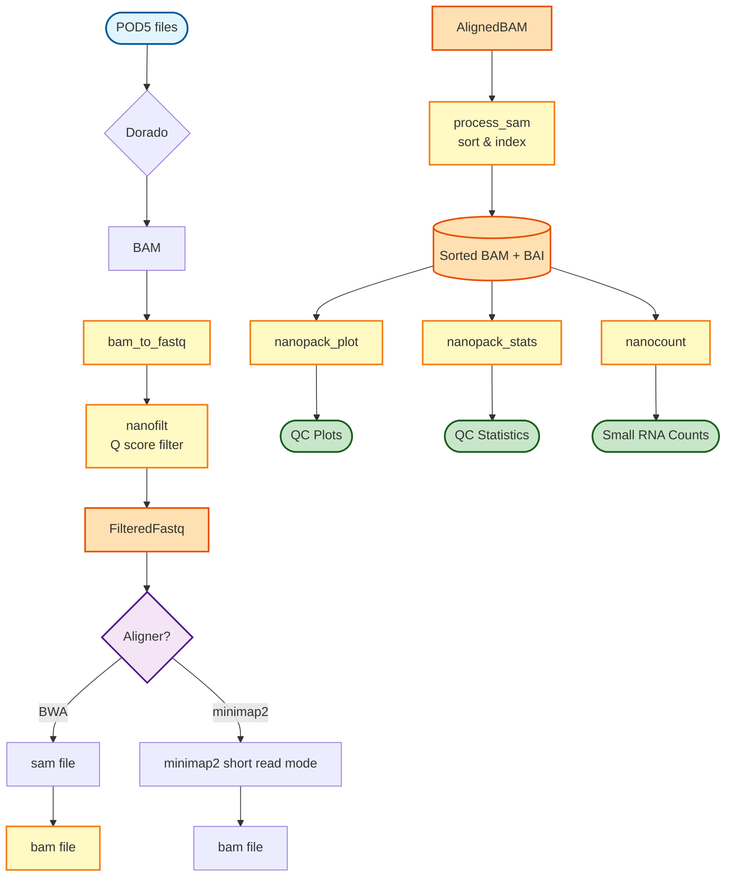

# Small RNA Pipeline Flowchart



## Pipeline Overview

### Input Requirements
- **Sample Info File**: Tab-separated file with sample metadata
- **Reference Genome**: FASTA format for alignment

### Workflow Stages

#### 1. Basecalling (3 modes)
- **use_fastq mode**: Direct FASTQ output from basecalling
- **skip_basecalling mode**: Start from existing BAM files
- **Standard mode**: BAM output from basecalling

#### 2. Quality Filtering
- Converts BAM to FASTQ (if needed)
- Filters reads by Q score using NanoFilt (default: Q > 10)

#### 3. Alignment (2 options)
- **BWA** (default): Optimized for Nanopore small RNA
  - Uses preset: `-x ont2d -C -W 13 -k 6`
- **Minimap2** (optional): Faster alternative
  - Uses preset: `-ax sr`

#### 4. Post-processing
- **process_sam**: Sort BAM and create index
- **nanopack_plot**: Generate QC visualizations
- **nanopack_stats**: Compute QC statistics
- **nanocount**: Quantify small RNA expression

### Output Files
- Sorted BAM files with indices
- QC plots and statistics
- Small RNA count matrices

## Key Parameters

```bash
--use_fastq         # Output FASTQ directly from basecalling
--skip_basecalling  # Start from existing BAM files
--use_minimap2      # Use minimap2 instead of BWA
--min_qscore 10     # Minimum Q score for filtering
```

## Usage Example

```bash
# Standard run with BWA
nextflow run workflows/small_rna_pipeline.nf \
    --sample_info samples.txt \
    --reference genome.fa

# Use minimap2 for faster alignment
nextflow run workflows/small_rna_pipeline.nf \
    --sample_info samples.txt \
    --reference genome.fa \
    --use_minimap2 true

# Skip basecalling, start from BAM files
nextflow run workflows/small_rna_pipeline.nf \
    --sample_info samples.txt \
    --reference genome.fa \
    --skip_basecalling true
```
